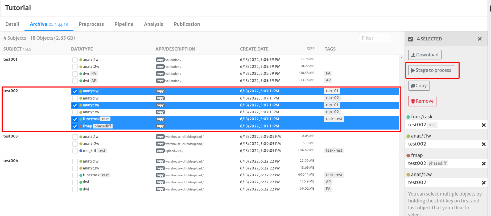
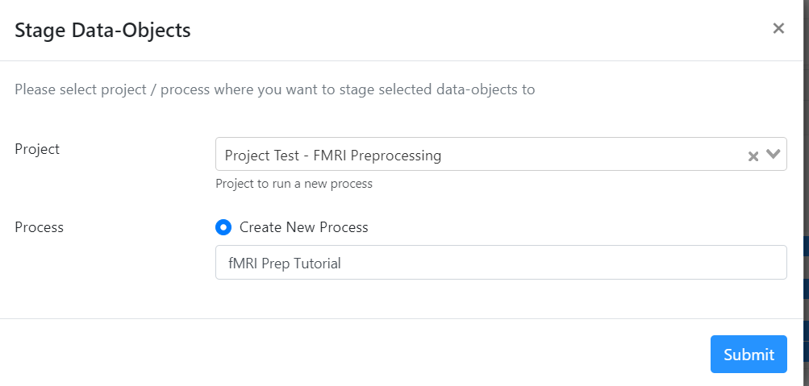
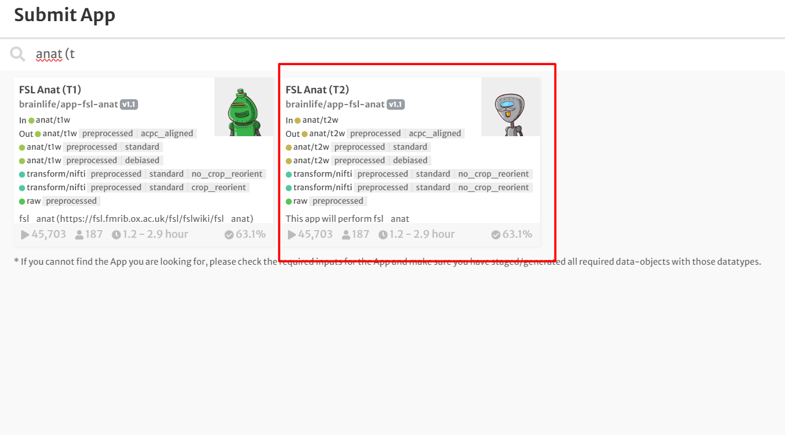
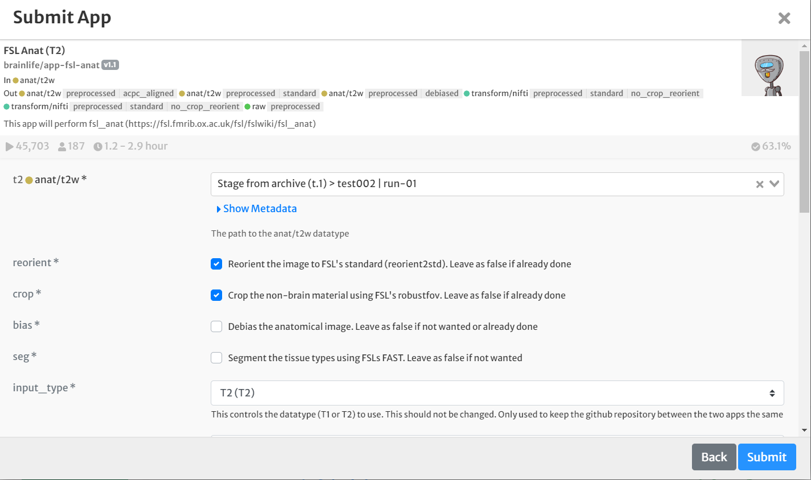
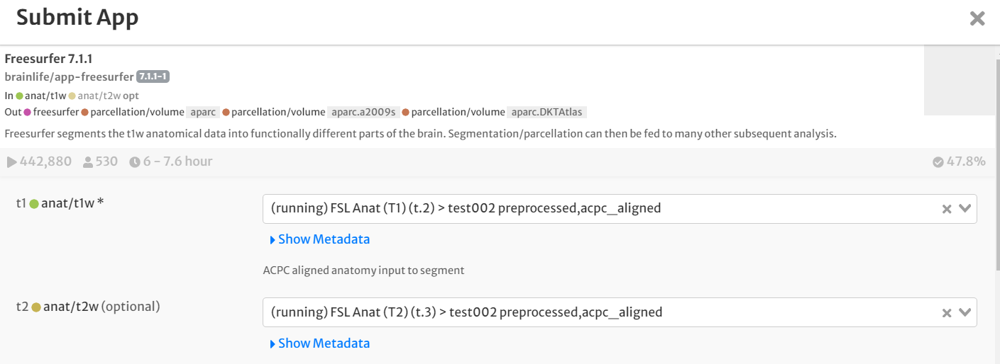
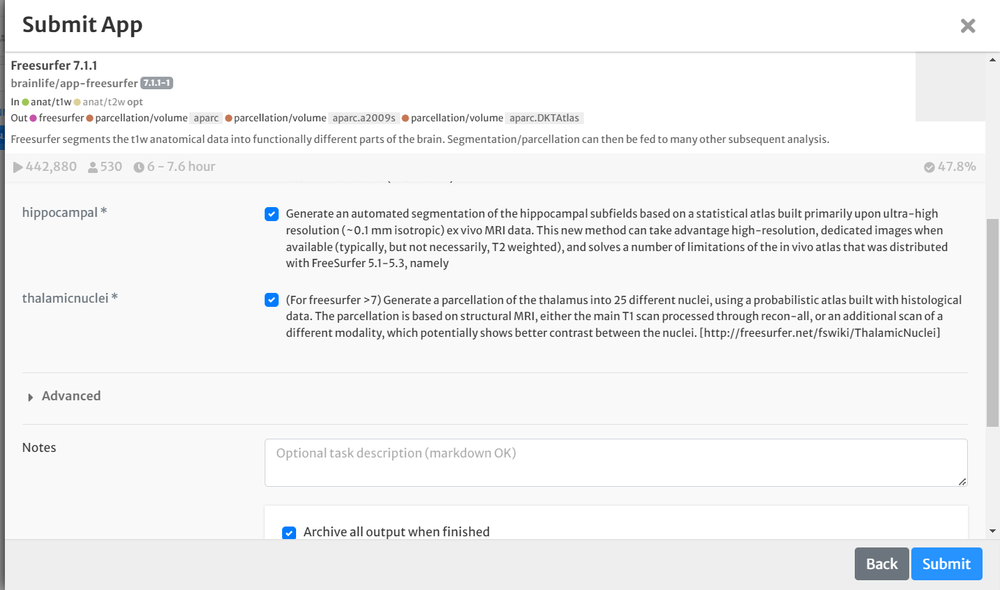
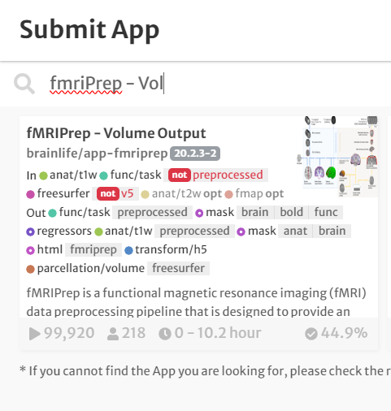
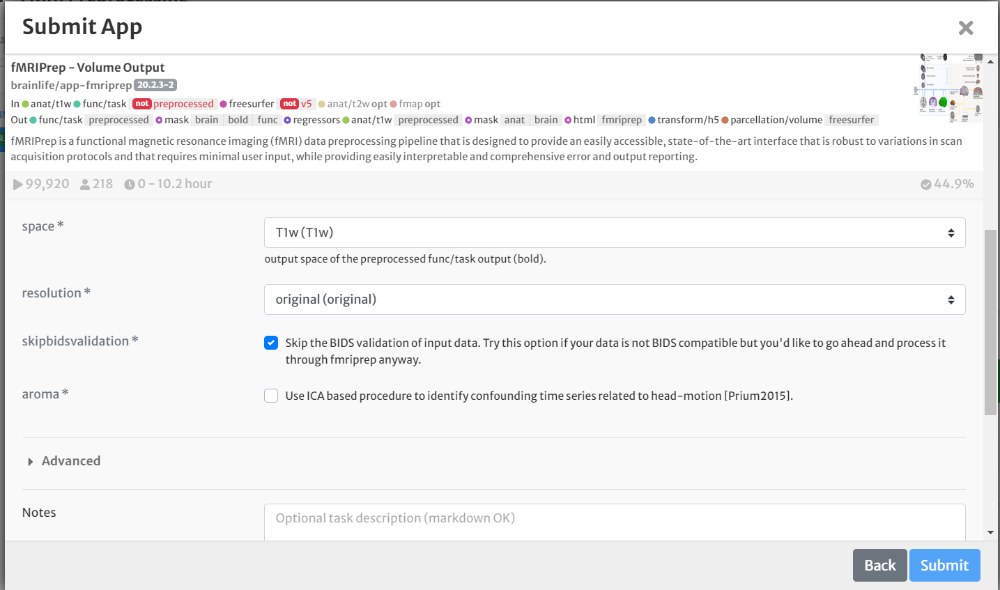

## Functional MRI (fMRI) preprocessing.

This page demonstrates common steps used to preprocess functional magnetic resonance imaging (fMRI) data on brainlife.io The goal of this tutorial is to show you how to process functional data for successive analyses, including **functional region analysis** and **functional connectivity** (you'll learn more about both below). This tutorial will be using [fMRIPrep](https://www.ncbi.nlm.nih.gov/pmc/articles/PMC6319393/) for all anatomical and fMRI processing. We'll be looking at [fMRIPrep - Volume Output](https://brainlife.io/app/5c61c69f14027a01b14adcb3).

This tutorial will use a combination of skills developed in the [Introduction tutorial](https://brainlife.io/docs/tutorial/introduction-to-brainlife/) you recently completed. If you haven't read our introduction to brainlife, or if you're not comfortable staging, processing, archiving, and viewing data on brainlife.io, please go back through that tutorial before beginning this one.

### 1. Anatomical preprocessing.

The first step of diffusion preprocessing often involves processing the anatomical images. In order to guarantee that any generalizations regarding location made from the preprocessed diffusion data is anatomically-informed, we must have both of our anatomical (T1w or T2w) images and our diffusion MRI images **aligned**. One way we can make this easier for [fMRIPrep](https://brainlife.io/app/5c61c69f14027a01b14adcb3) is by aligning the anatomical images in such a way that the center of the brain is centered in the image. We refer to this as **ACPC-aligned**, as we are aligning the data to the **anterior commissure-posterior comissure plane**. This is the first step in fMRI preprocessing, and it is typically done with the [FSL Anat (T1w)](https://brainlife.io/app/5e3c87ae9362b7166cf9c7f4) app. Once we've centered our anatomical image, we can move onto functional MRI preprocessing.

### 2. Functional preprocessing.

The second step of fMRIPrep involves processing the functional (fMRI) images. These can include both task-related (a person performing a task in the scanner) or resting-state (a person does no task in the scanner) fMRIs. Like any image directly from the scanner, there are common artifacts and issues with fMRI data. One of the biggest problems is **motion**. Because some scans take a long time, it is nearly impossible for a participant to lie completely motionless. Even the most subtle movements can alter the results in a specific region and make your data less accurate. fMRIPrep will estimate the motion that occurred across all of the fMRI volumes and correct for it. This will align all of the volumes perfectly to ensure motion is not altering the data.

Another common artifact in fMRI data is **susceptibility distortions**. This is when regions of the brain look "wavy" or fold inward or outward on itself in images. This is due to how the scanner sweeps across the entire brain during acquisition -- fMRIPrep will also automatically correct for this!

fMRIPrep can additionally fix the lag in the BOLD signal and the fact that we need to acquire data in non-contiguous slices. This is referred to as **slice-timing**, or the order in which slices are acquired. Without fMRIPrep, our data would not be ordered properly and we wouldn't have contiguous brain slices.

Finally, images from the fMRI scanner might not be perfectly aligned to images collected before it, such as the anatomical images. To fix this, we need to register the functional volumes to the anatomical image and map the fMRI signal onto the surfaces generated in the anatomical preprocessing step -- fMRIPrep does this registration automatically!

Useful information about fMRIPrep anatomical preprocessing can be found in this [original Nature paper](https://www.ncbi.nlm.nih.gov/pmc/articles/PMC6319393/#S13title).

There are two versions of the brainlife.io fMRIPrep app. One generates outputs mapped to the volumes ([fMRIPrep-volume](https://brainlife.io/app/5c61c69f14027a01b14adcb3)) and the other generates outputs mapped to the surfaces ([fMRIPrep-surface](https://brainlife.io/app/5dfceebd32bff0640ce27bbd)).

For this tutorial, we will use the volume-based version.

Now, let's get to work! The following steps of this tutorial will show you how to:
1. preprocess the anatomical (T1w & T2w) data using FSL
2. generate anatomical surfaces using Freesurfer,
3. preprocess the fMRI data using fMRIPrep

### Copy appropriate data over from a single subject in the Tutorial data project

1. Click the following link to go to the project's page for the [Tutorial](https://brainlife.io/project/5e7638f6de643b02832a8246/detail)
1. Click the 'Archive' tab at the top of the screen to go to the archive's page.
1. Select the following datatypes from one subject by clicking the boxes next to the data for subject 'test002':
    * func/task rest
    * anat/t1w (run-01 tagged)
    * anat/t2w (run-01 tagged)
    * fmap
    
1. Click the 'Stage to process' button on the right side of the screen
    * For 'Project', select your project from the drop-down menu.
    * For 'Process', select 'Create New Process' and title it "fMRI Prep Tutorial". Hit 'Submit'.
        * This will take you to the process on your Project's page
    
1. Archive the data in your project by clicking the 'Archive' button next to each dataset.
    

Your data should now be staged for processing and archived in your projects page! You're now ready to move onto the first step: preprocessing the anatomical data!

### Preprocess anatomical (T1w & T2w) data using FSL:

#### T1w data
1. On the 'Process' tab of your project, click 'Submit App' to submit a new application.
    * In the search bar, type 'FSL Anat (T1w).'
    * Click the app card.

1. On the 'Submit App' page, select the following:
    * For input, select the staged raw anatomical (T1w) image by clicking the drop-down menu and finding the appropriate datasets.
    * Select the boxes for 'crop' and 'reorient'. Leave all other defaults the same.
    
    * Select the box for 'Archive all output datasets when finished'
        * For 'Dataset Tags,' type and enter 'fsl_anat'
    * Hit 'Submit'
1. Once the app is finished running, view the results by clicking the 'eye' icon to the right of the dataset
    * Choose 'FSLeyes' as your viewer
        * This will load the the preprocessed T1w data.

#### T2w data
1. On the 'Process' tab of your project, click 'Submit App' to submit a new application.
    * In the search bar, type 'FSL Anat (T2w).'
    * Click the app card.
    
1. On the 'Submit App' page, select the following:
    * For input, select the staged raw anatomical (T2w) image by clicking the drop-down menu and finding the appropriate datasets.
    * Select the boxes for 'crop' and 'reorient'. Leave all other defaults the same.
    * Select the box for 'Archive all output datasets when finished'
    
        * For 'Dataset Tags,' type and enter 'fsl_anat'
    * Hit 'Submit'
1. Once the app is finished running, view the results by clicking the 'eye' icon to the right of the dataset
    * Choose 'FSLeyes' as your viewer
        * This will load the the preprocessed T2w data.

Once you're happy with the surfaces, you can move onto running Freesurfer!

### Generate surfaces using Freesurfer:

1. On the 'Process' tab of your project, click 'Submit App' to submit a new application.
    * In the search bar, type 'Freesurfer 7.1.1'
    * Click the app card.
    
1. On the 'Submit App' page, select the following:
    * For input, select the staged preprocessed, 'acpc_aligned'-tagged anatomical (T1w & T2w) images by clicking the drop-down menu and finding the appropriate datasets.
    * Select the boxes for 'hippocampal' and 'thalamicnuclei'. Leave all other defaults the same
    

    

    
    * Select the box for 'Archive all output datasets when finished'
        * For 'Dataset Tags,' type and enter 'fsl_anat'
    * Hit 'Submit'
1. Once the app is finished running, view the results by clicking the 'eye' icon to the right of the dataset
    * Choose 'freeview' as your viewer
        * This will load the following volumes and surfaces: aseg, brainmask, white matter mask, T1, left/right hemisphere pial (cortical), and white (white matter) surfaces.
    * To view the aparc.a2009s segmentation on an inflated surface, do the following:
        * Click File --> Load surface
            * Choose the lh.inflated and rh.inflated surfaces
            * Hit 'OK'
        * Select inflated surface of choice (i.e. left or right hemisphere)
        * Click the drop-down menu next to 'Annotation' and choose 'Load from file'
            * Choose the appropriate hemisphere aparc.a2009s.annot file (lh.aparc.a2009s.annot)
            * Hit 'OK'
            * The aparc.a2009s parcellation should be overlaid on your inflated surface! Now, repeat the process on the other hemisphere.

Once you're happy with the surfaces, you can move onto running fMRIPrep!

### Preprocess your data with fMRIPrep:

1. On the 'Process' tab of your project, click 'Submit App' to submit a new application.
    * In the search bar, type 'fmriPrep - Volume Output'
    * Click the app card.
    
1. On the 'Submit App' page, select the following:
    * For input, select the staged preprocessed, 'acpc_aligned'-tagged anatomical (T1w & T2w) images, the freesurfer output, the fmap, and the functional data by clicking the drop-down menu and finding the appropriate datasets.
    * For 'space,' select 'T1w' from the drop-down menu.
    * Set 'skipbidsvalidation' to True. Leave all other options as default.
    * Select the box for 'Archive all output datasets' when finished
        * For 'Dataset Tags,' type and enter 'fmriprep'
    * Hit 'Submit'
    
    
1. Once the app is finished running, view the results by clicking the 'eye' icon next to the 'html' tagged output.
    * Choose the 'html' viewer

**If you're happy with the results, then you have successfully finished preprocessing your fMRI data with fMRIPrep! You're now ready to move onto the next tutorial!**
