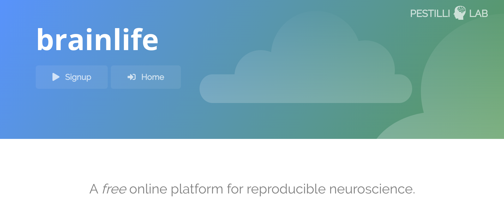
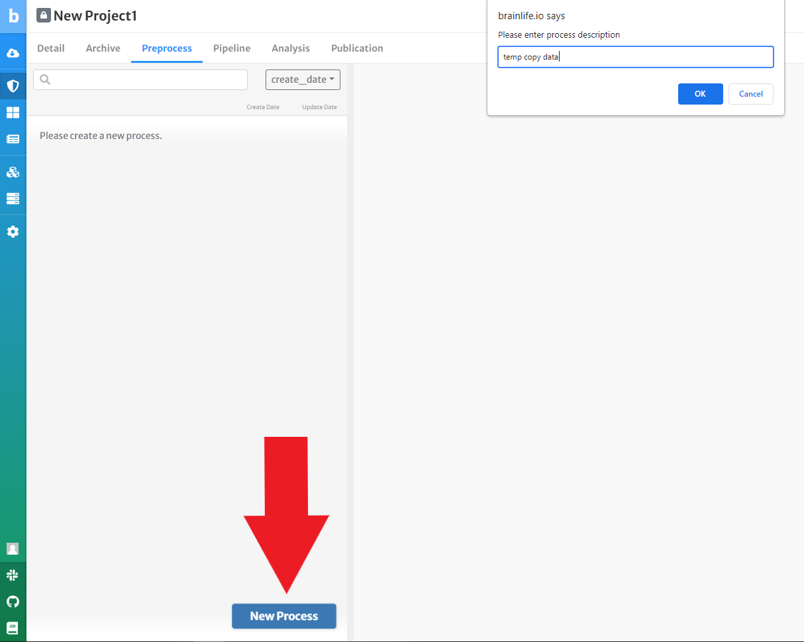
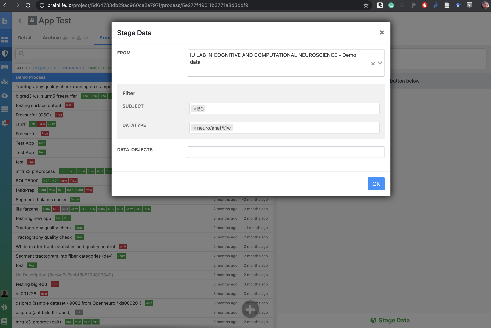
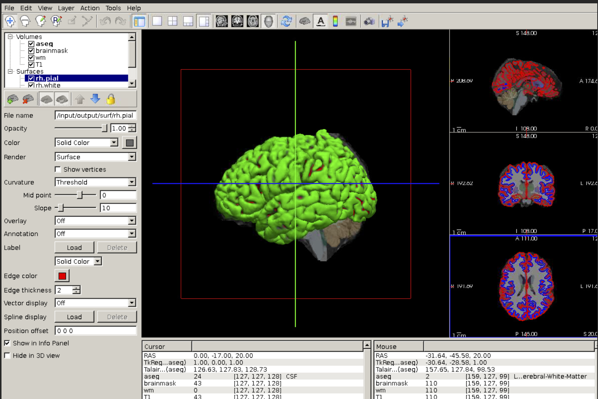
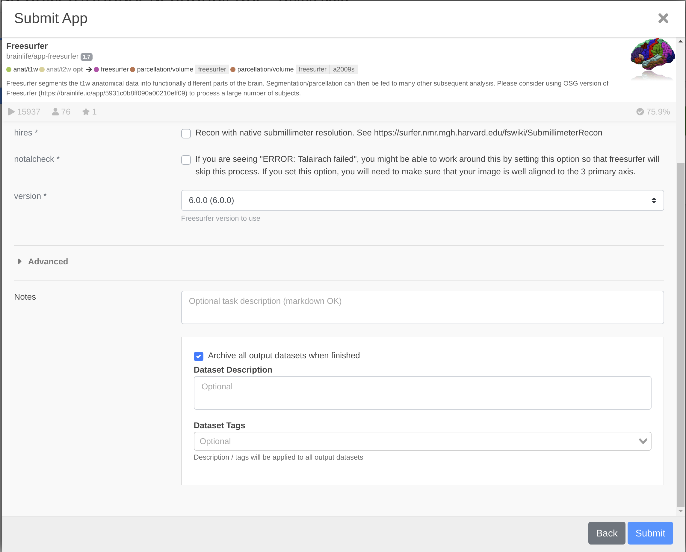

!!! warning
    This is a draft

## Introduction to brainlife.

This page highlights the most important first steps in learning how to use brainlife.io, including creating an account and project, interacting with datasets, launching processes, visualizing results, and creating pipelines. If you have not read the documentation regarding these topics, please see [Getting Started/](/docs/user/started).

### A. Create an account.

The first step to processing data using brainlife is to go to brainlife.io and create an account.

To do make an account and project, follow these steps:

1. Enter brainlife.io into your browser web address. 
1. Once on the homepage, click the "signup" button in the top left corner.
    * Enter the following information on the signup page:
        * username
        * email
        * password
        * full name
        * institution/university
        * biography
        * position (undergraduate student)
1. Read the Acceptable Use and Privacy policies and then check the box that says "I have read and consent to brainlife.io Acceptable Use Policy and Privacy Policy" and hit submit

### B. Create a Project.

Next we will start managing some data on the platform by creating a Project.

1. Go to the [brainlife.io home page](https://brainlife.io){target=_blank} and click 'home.' This will bring you inside the platform.
1. Click the 'Projects' tab on the left side of the screen (shield icon).
1. Click the 'New Project' button at the bottom right corner of the screen.
    * Enter the following information on the New Project page:
        * Name
        * Description
        * Readme
        * Navigate to Access Control and add the following accounts in Administrators (if you start typing a name, the system will autocomplete for you):
            * Brad Caron
            * Soichi Hayashi
            * Franco Pestilli
    * Click submit.
1. Return to the projects page and select your newly created project.

You are now ready to copy data from another project!

### C. Copy data from another project.

The next step will be to copy data into your project. For that, we will use open data from another project.

To copy data from an open project follow the steps below.

1. Go to the main page of your project.
1. Click on the 'Preprocess' tab.
1. Once inside the Preprocess tab, click the 'New Process' button at the bottom-right of the screen. 
1. Add a new process and name it 'temp copy data' in the projects description tab.

1. Select the newly created process and hit the 'Stage Data' button at the bottom right corner of the screen.  
    * In the 'From' section, select the 'IU LAB IN COGNITIVE AND COMPUTATIONAL NEUROSCIENCE - Demo Data' project to pull data from.
    * For "Subject,' enter BC
    * For 'Datatype,' you will select a single anatomical file this is a T1-weighted MRI (T1w). The brianlife.io Datatypes is called: neuro/anat/T1w
    * For 'Data-object,' click the dropdown menu and select the appropriate data. Since there's only one T1, the correct dataset should auto-populate.
    * Hit 'OK.'

 
The data is now staged and ready for processing!

<!---
To upload your own data, follow the following steps:
1) Select your project from the projects page.
2) Select the 'archive' tab at the top of the screen.
3) On the archive page, click the '+' button at the bottom of the screen.
4) For datatype, choose the specific datatype for each image type (T1, T2, DWI, fMRI):
    * For each datatype, you'll need to choose the appropriate data files and a subject name (i.e. your randomly assigned ID). You can leave the rest of the fields empty.
    * Once you fill this information, hit next and then archive.
The data is now uploaded and archived to your project!
--->

### D. Launch a process, application (app), visualize and archive the results.

The next step is to launch an application (app) in order to process the data. For this, we will process the T1w (anatomical) image staged in C. In this tutorial, we will divide (i.e. segment/parcellate) the T1 anatomical image using Freesurfer.

First we will need to To launch a process using the following steps:

1. On the 'Preprocess' tab, make sure the process generated in [Part C](/docs/tutorial/introduction-to-brainlife/#c-copy-data-from-another-project) is selected.
1. Click on the 'Submit App' button at the bottom right of the screen. This will launch a page with the many apps that can be used on your staged data. 
1. In the searchbar, type 'Freesurfer' and click on the app card. This will open a page with options for choosing which project to save the results and specific input parameters that may affect the outputs of the app.
1. For now, leave all the inputs and parameters as is. We will discuss what these options do in later tutorials.
1. Hit 'OK.'

Once the app is launched, a card will appear on the 'Preprocess' tab with a blue header. This means the app is currently running, or waiting to run. 

Once this turns green, that means the app is finished and you can view the results!

To view the results:

1. Click the eye icon next to the output and choose 'Freeview' as your viewer.

This will automatically load important outputs generated by Freesurfer, including cortical and white matter surfaces and a standard parcellation of the cortical surface.

In order to make sure the generated data does not get deleted over time, we need to save (i.e. archive) the data. Archived data can be viewed and staged via the 'Archive' tab on the Projects page. There are two ways to archive data on brainlife.io: when submitting the and after the app is completed.

To archive the data automatically once the app is finished running, follow these steps:

1. After Step 4 above, click the box next to the option 'Archive all output datasets when finished.' This will save (i.e. archive) the data immediately following completion of processing.

To archive the data after the app is completed and you've reviewed the results, follow these steps:

1. In the 'Output' section, select the file drawer icon on the far right of the screen.
1. Hit 'OK.'

### You're finished! ###

You've now successfully created an account and project, copied data from an open project, and launched an application and processed your first MRI data on brainlife.io!
