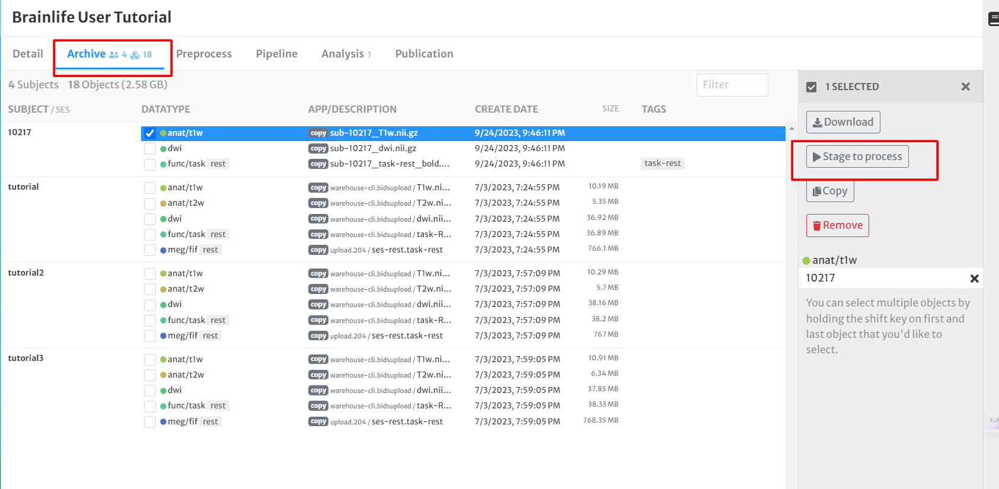
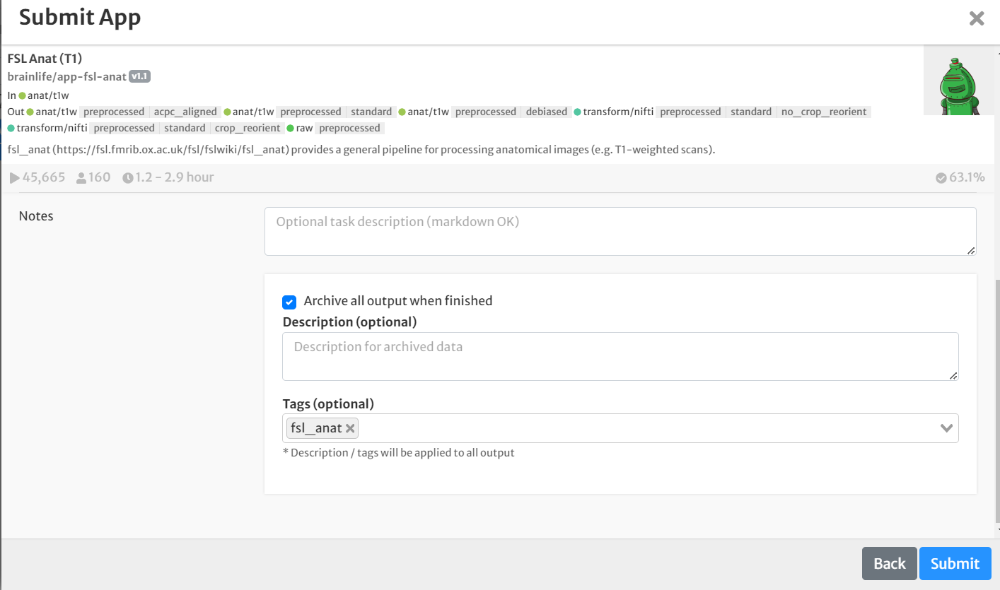
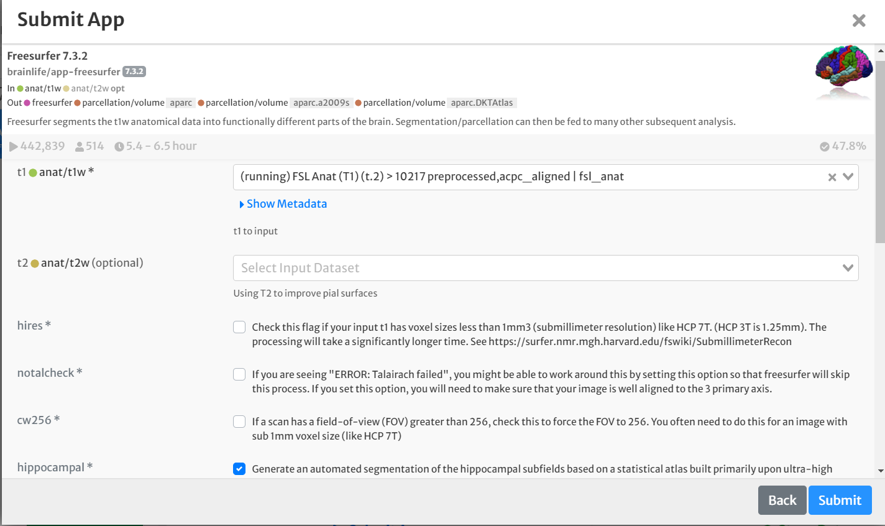
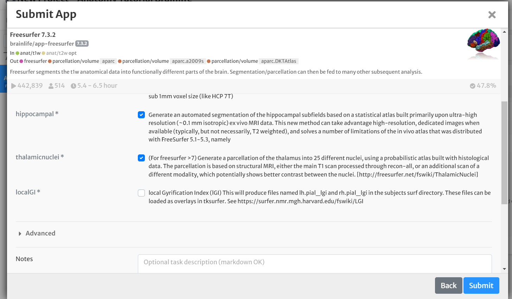
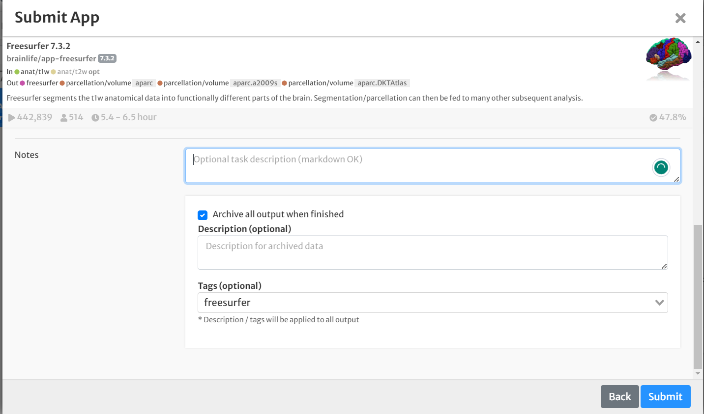
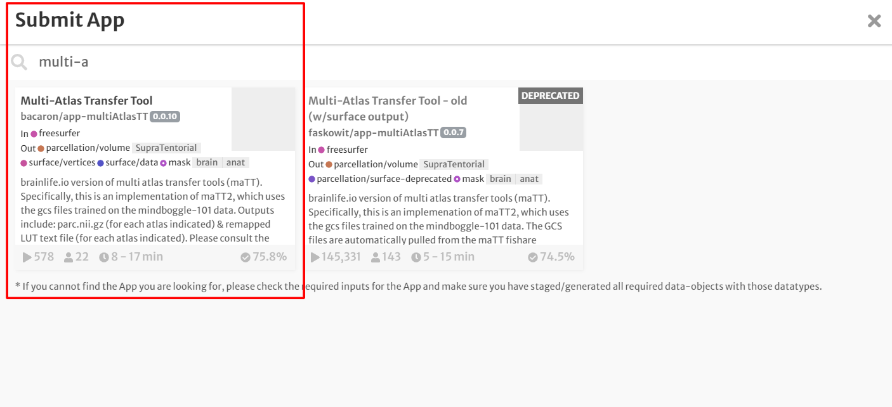
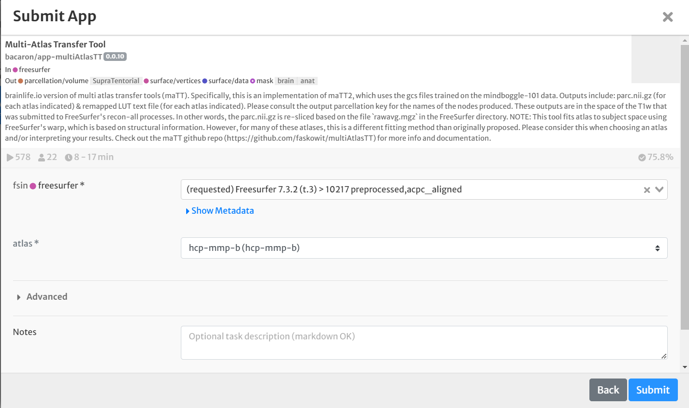
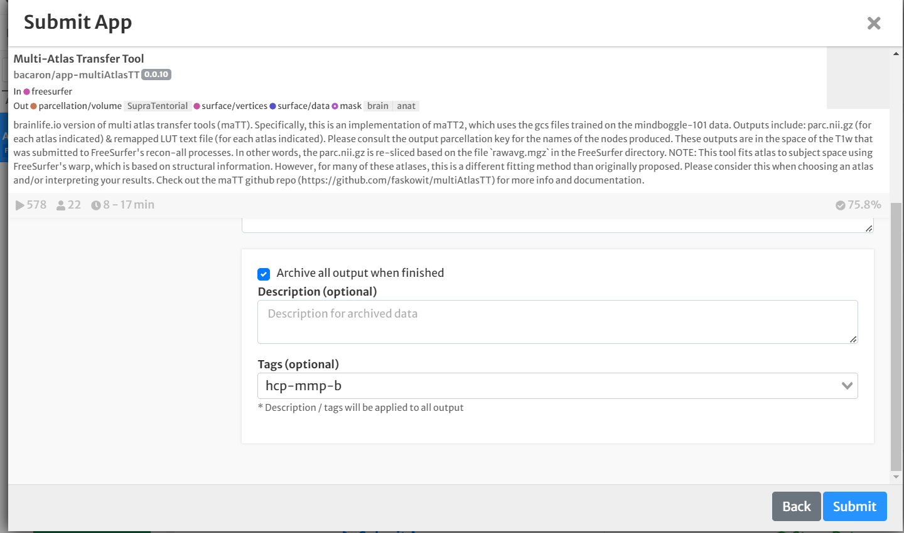
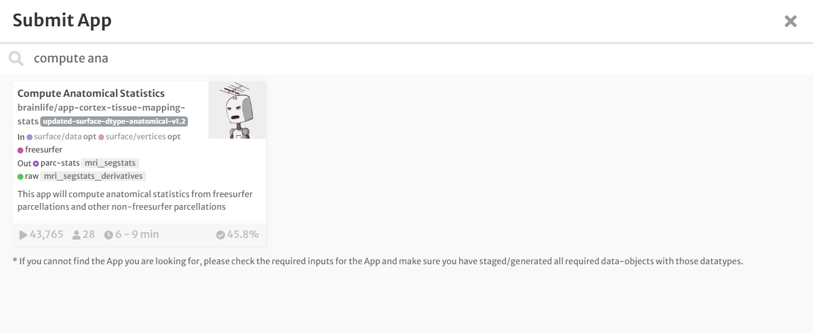

## Anatomical (T1w) preprocessing.

This page demonstrate common steps used to preprocess anatomical magnetic resonance imaging data (T1-weighted or T1w) on brainlife.io. The goal of this tutorial is to show how to process anatomical data for successive analyses – volumetric analyses from T1w measures, and/or a combination of T1w and diffusion-weighted MRI (dMRI) or functional neuroimaging data (fMRI) pipelines.

This tutorial will use a combination of skills developed in the [introduction-to-brainlife tutorial](/docs/tutorial/introduction-to-brainlife/). If you have not read this, or you are not comfortable staging, processing, archiving and viewing data on brainlife.io, please go back and follow that tutorial before beginning this one.

### 1. Preprocessing and alignment of T1w images

In many cases, raw anatomical (T1w) images can vary in terms of orientation, alignment, the extent of the head contained in the image, and the amount of artifacts present depending on the scanner and the acquisition parameters of the sequence. To address this, the first step of anatomical (T1w) processing involves standardizing the orientation and alignment of the image, and removal of non-brain material and common image artifacts from the image.

The first step of this process is to make sure the anatomy of the brain 'looks right.' This means that the coordinate system for the T1w image is stored rotated such that the brain appears up-right and centered when opened in the major visualization toolboxes that the scientific community uses (i.e., generally we look at images where the nose faces towards right-hand side in the sagittal plane, and forward in the axial and coronal planes). This rotation involves changing information in the T1w data files and headers. Beside agreeing to the standard conventions, this orientation is important because it assures that the data inside the T1w images will be "indexed,"  or read, appropriately allowing different software libraries for neuroimaging data analysis to  read the data, interpret the position and dimensions of individual three-dimensional pixels (i.e., voxels). During this process oftentimes the neck is removed from the original MRI data, so to fit the image within an adequate volume. 

Useful information about MRI image orientation can be found at:
- [FSL, Orientation Explained](https://fsl.fmrib.ox.ac.uk/fsl/fslwiki/Orientation%20Explained)
- [Gardner Lab, Coordinate Transforms](http://gru.stanford.edu/doku.php/mrTools/coordinateTransforms)

The next step following this is to align the anatomical image to the point where two white matter tracts cross hemispheres: the anterior commissure and posterior commissure (ACPC). The anterior commissure connects the two temporal lobes and is located below the anterior portion of the corpus callosum (i.e. fornix), the large white matter tract connecting the two hemispheres. The posterior commissure is located just behind the cerebral aqueduct, an important connection between the third and fourth ventricles. This step will move the image in a way that effectively "centers" the image. Specifically, the image will be moved so that a horizontal line drawn from the front to the back of the brain will pass through both landmarks, and a horizontal line drawn from the temporal lobes and a vertical line from the top of the brain to the bottom bisect at the midpoint of the two landmarks. Typically this is done by linearly-aligning an anatomical T1w image to a standard template (ex. MNI) that has already been aligned to these planes. A majority of the following processing steps require the anatomical image to be aligned to the ACPC plane, including Freesurfer parcellation.

<!-- need image of planes and alignment -->

On brainlife.io, all of these steps can be performed with just a single app! Specifically, this can all be done using the [FSL Anat (T1)](https://brainlife.io/app/5e3c87ae9362b7166cf9c7f4) app. This app was designed around the FSL function [fsl_anat](https://fsl.fmrib.ox.ac.uk/fsl/fslwiki/fsl_anat). Depending on certain aspects of the anatomical T1w image, specifically the image resolution, this app may take anywhere from 1 to 3 hours. If running for longer than 3 hours, something may be wrong...

### 2. Freesurfer Surface Generation and Parcellation.

The next step is to perform anatomical preprocessing and divide (i.e. parcellate) the brain into different regions and tissue types (i.e. white matter, gray matter) using Freesurfer. These regions represent different gray matter (i.e. cortical) landmarks such as the motor and somatosensory cortices, and are typically derived from histological properties of these regions. Sometimes, they are even derived from functional activation (i.e. fMRI) patterns. Freesurfer will divide the anatomical image into different tissue types (i.e. white matter, gray matter), parcellate the gray matter into known anatomical landmarks, and output statistics regarding the volume and thickness of the different tissue types and anatomical landmarks. These regions are then used for a large number of downstream steps, including white matter tract segmentation. Information regarding the volume and thickness of each region can also be used for group analyses. This can be done on brainlife.io using the [Freesurfer](https://brainlife.io/app/5fe1056057aacd480f2f8e48) app.

<!-- need images of tissues types and cortical segmentation from freesurfer -->

### 3. Mapping of additional parcellations

The previous step (Freesurfer) will automatically map three different cortical parcellations: aparc, aparc.a2009s (Desikan-Killany), and aparc.DKTatlas (DKT atlas). However, these are not the only three brain parcellations that exist! In fact, there's more than one way to divide up the cortical brain! Some of these additional parcellations include the HCP multi-modal parcellation (hcp-mmp-b; Glasser 2018) and the Yeo 17 Resting-State parcellation (yeo17dil; Yeo 2011). The next step is to map some of these additional parcellations.The final step is to take the parcellation generated from Freesurfer and collate the important statistics into a .csv file for easy viewing and implementation of group analyses. This can be done on brainlife.io using the [Multi-Atlas Transfer Tool](https://brainlife.io/app/6016dcdc321a4aafce6decd5) app.

<!-- need images of different parcellations -->

### 4. Freesurfer Brain Parcellation - Statistics.

The final step is to take the parcellation generated from Freesurfer and the other parcellations we mapped and collate the important statistics into a .csv file for easy viewing and implementation of group analyses. Within each region of the parcellation (i.e. ROI), Freesurfer computes simple statistics regarding the number of vertices, surface area, volume, cortical thickness, mean and gaussian curvatures, and the fold and curvature indices. These statistics can be used to perform group-level analyses, including group differences within ROIs and correlation analyses with behavioral data. This can be done on brainlife.io using the [Compute Anatomical Statistics](https://brainlife.io/app/64a32d3a3a63cf17374f6e75) app.

Now, let's get to work! The following steps of this tutorial will show you how to:

1. Preprocess and align the anatomical (T1w) image,
1. generate cortical and white matter surfaces and parcellations using Freesurfer,
1. map an additional parcellation to the Freesurfer data
1. obtain common statistics from the each parcellation.

### Copy appropriate data over from a single subject in the Tutorial project

1. Click the following link to go to the project's page for the [Tutorial](https://brainlife.io/project/5ae916e7f446980028b15eb3)
1. Click the 'Archive' tab at the top of the screen to go to the archive's page.
1. Select the following datatypes from one subject by clicking the boxes next to the data for subject '10217':
    * anat/t1w

1. Click the 'Stage to process' button on the right side of the screen
    * For 'Project', select your project from the drop-down menu.
    * For 'Process', select 'Create New Process' and title it "Anatomical (T1w) Prep Tutorial". Hit 'Submit'.
        * This will take you to the process on your Project's page
1. Archive the data in your project by clicking the 'Archive' button next to each dataset.

Your data should now be staged for processing and archived in your projects page! You're now ready to move onto the first step: crop and reorient the T1w image!

### Preprocess the anatomical image.

1. On the 'Process' tab, click 'Submit App' to submit a new application.
    * In the search bar, type 'FSL Anat (T1)'
    * Click the app card.

1. On the 'Submit App' page, select the following:
    * For input, select the staged raw anatomical (T1w) image by clicking the drop-down menu and finding the appropriate dataset.
    * Select the boxes for 'crop', 'reorient' and 'bias'
    * For template, choose the 'MNI152_1mm' option from the drop-down menu.
    * Select the box for 'Archive all output datasets when finished'
        * For 'Dataset Tags,' type and enter 'fsl_anat'
    * Hit 'Submit'

1. Once the app is finished running, view the results by clicking the 'eye' icon to the right of the dataset
    * Choose 'fsleyes' as your viewer
1. You can also generate a QA image of the results by running the 'Generate images of T1' using the cropped and reoriented anatomical image generated above! Archive the results and save with the tag 'qa' and "fsl_anat".

Once you're happy with the alignment, you can move onto Freesurfer!

### Freesurfer Surface Generation and Parcellation.

1. On the 'Process' tab, click 'Submit App' to submit a new application.
    * In the search bar, type 'Freesurfer 7.3.2'
    * Click the app card.

1. On the 'Submit App' page, select the following:
    * For input, select the ACPC aligned anatomical image generated above by clicking the drop-down menu and finding the appropriate datasets.
    * Select the boxes for 'hippocampal' and 'thalamicnuclei'
    * Select the box for 'Archive all output datasets when finished'
        * For 'Dataset Tags,' type and enter 'freesurfer'
    * Hit 'Submit'

1. Once the app is finished running, view the results by clicking the 'eye' icon to the right of the dataset
    * Choose 'freeview' as your viewer
        * This will load the following volumes and surfaces: aseg, brainmask, white matter mask, T1, left/right hemisphere pial (cortical), and white (white matter) surfaces.
    * To view the aparc.a2009s segmentation on an inflated surface, do the following:
        * Click File --> Load surface
            * Choose the lh.inflated and rh.inflated surfaces
            * Hit 'OK'
        * Select inflated surface of choice (i.e. left or right hemisphere)
        * Click the drop-down menu next to 'Annotation' and choose 'Load from file'
            * Choose the appropriate hemisphere aparc.a2009s.annot file (lh.aparc.a2009s.annot)
            * Hit 'OK'
            * The aparc.a2009s parcellation should be overlaid on your inflated surface! Now, repeat the process on the other hemisphere.

Once you're happy with the surfaces, you can move on to computing statistics!

### Map the hcp-mmp-b atlas:

1. On the 'Process' tab, click 'Submit App' to submit a new application.
    * In the search bar, type 'Multi-Atlas Transfer Tool'
    * Click the app card.

1. On the 'Submit App' page, select the following:
    * For input, select the staged Freesurfer output generated above by clicking the drop-down menu and finding the appropriate dataset.
    * For 'atlas,' select 'hcp-mmp-b' from the drop-down menu.
    * Select the box for 'Archive all output datasets' when finished
        * For 'Dataset Tags,' type and enter 'hcp-mmp-b'
    * Hit 'Submit'

Once the app is finished, you're ready to move onto the next step: Computing anatomical statistics!

### Freesurfer Brain Parcellation - Statistics.

1. On the 'Process' tab, click 'Submit App' to submit a new application.
    * In the search bar, type 'Compute Anatomical Statistics'.
    * Click the "Compute Anatomical Statistics" app card.

1. On the 'Submit App' page, select the following:
    * For 'parc_surface', select the surface/data output generated in Step 4 by clicking the drop-down menu and finding the appropriate dataset (look for the dataset tag 'hcp-mmp-b').
    * For 'parc_surf_vertices', select the surface/vertices output generated in Step 4 by clicking the drop-down menu and finding the appropriate dataset (look for the dataset tag 'hcp-mmp-b').
    * For 'freesurfer', select the Freesurfer output generated in Step 3 by clicking the drop-down menu and finding the appropriate dataset (look for the dataset tag 'freesurfer'.
    * Select the box for 'Archive all output datasets when finished
        * For 'Dataset Tags', type and enter 'anatomical_stats'
    * Hit 'Submit'

To view the results, download the data by clicking the 'download' button next to the dataset. Then open the 'merged' csv file into your favorite spreadsheet of choice (i.e. excel) and you're ready to start your group analyses!

**You have now finished preprocessing your anatomical (T1w) image! You are now ready to move onto the next tutorial!**
