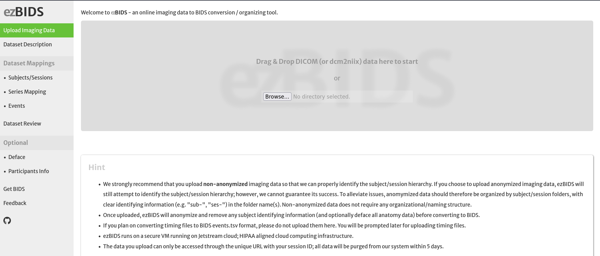
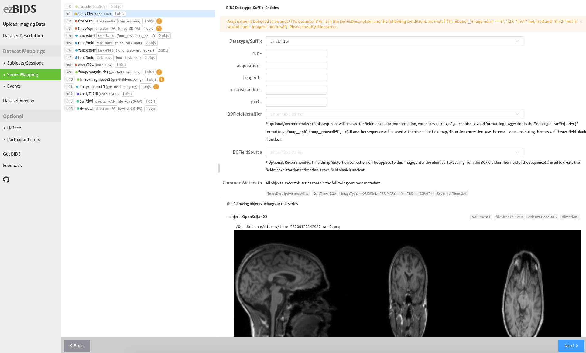
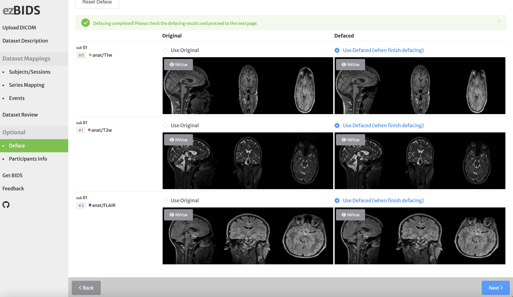
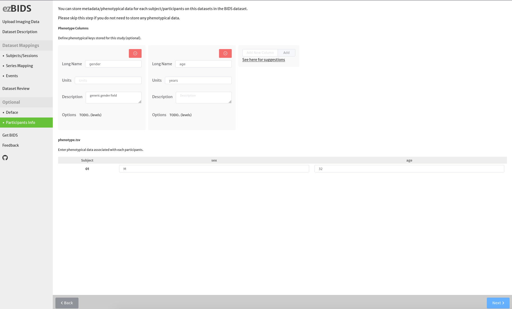
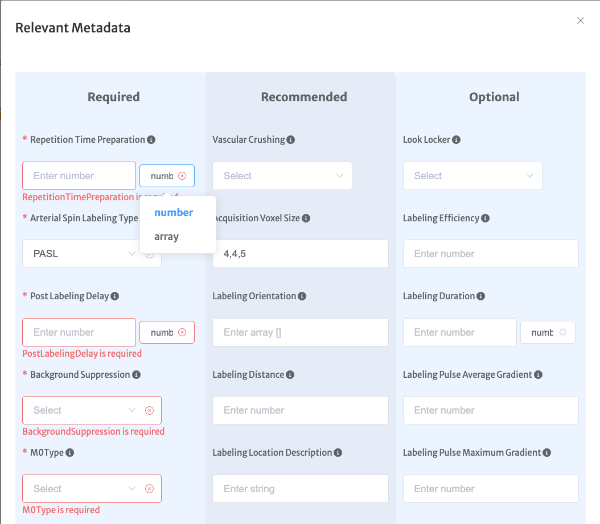
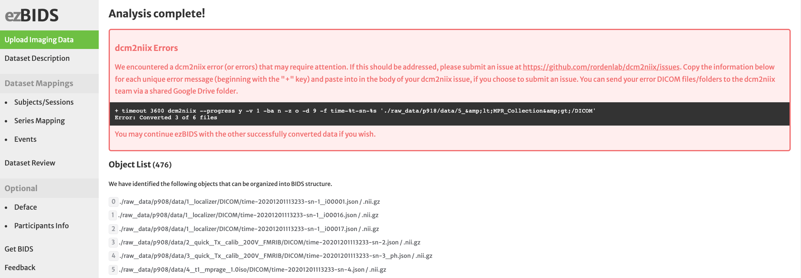

# **ezBIDS User Documentation**

[ezBIDS](https://brainlife.io/ezbids) is a web-based BIDS conversion tool that requires neither installation, programming proficiency, nor knowledge of the Unix terminal and BIDS specification. The term BIDS is an acronym that stands for the [Brain Imaging Data Structure](https://bids-specification.readthedocs.io/en/stable/). More specifically, BIDS is a format for describing and organizing (primarily neuroimaging) data, greatly enhancing data sharing within the scientific community, as well as enabling access to a suite of processing and analysis tools that can be automatically executed on BIDS data, known as [BIDS apps](https://bids-apps.neuroimaging.io/). This documentation provides an in-depth description of ezBIDS's functionality for converting data to BIDS.

If you are new to ezBIDS and would like to see a simple use case of ezBIDS, please refer to the [ezBIDS tutorial](https://brainlife.io/docs/tutorial/ezBIDS).

## A Primer to ezBIDS

The process of converting raw imaging data to BIDS is often time-consuming and can require substantial technical expertise. Furthermore, the BIDS specification, the rules governing how data must be described and organized, are complex and can be daunting for researchers relatively unfamiliar with BIDS. While there exist numerous tools for assisting users convert their data to BIDS (for complete lists, see [here](https://github.com/rordenlab/dcm2niix#links) and [here](https://bids.neuroimaging.io/benefits.html#mri-and-pet-converters)), these tools largely require a level of techninal experise and knowledge of BIDS. ezBIDS was designed to alleviate these requirements. 

Specifically, ezBIDS provides unique features that differentiate it from other BIDS conversion tools:

1. No installation or programming required. It works in your web browser.
2. Semi-automated inference and guidance for BIDS adherence. It makes educated guesses about how your data should be mapped into BIDS and proposes both initial BIDS mapping of your data and warnings on the things that might need your attention.
3. Conversion of task event/timing files associated with functional BOLD (`func/bold`) sequences. If you have collected data using a task ezBIDS will help you map your tasks events into BIDS.
4. Multiple data management options:
    * Download BIDS-converted data to a local computer or server.
    * Push BIDS-converted data to open-science archives and platforms, such as [OpenNeuro.org](https://openneuro.org/) and [brainlife.io](https://brainlife.io/about/).

Think about ezBIDS as a small, smart, decision support system. ezBIDS attempts to do the heavy lifting for users, interpreting the necessary descriptions of the data uploaded and mapping these descriptions to the corresponding BIDS descriptions. Critically, however, users have the ability to edit (or modify) the BIDS dataset created by ezBIDS. Using the ezBIDS web interface, users can ensure that the BIDS dataset created is appropriate and looks how they wants it.

---
## ezBIDS Walkthrough

### 1. Homepage

Upon reaching the [ezBIDS homepage](https://brainlife.io/ezbids), users can click on the "Get Started" button to begin converting their data.

### 2. Upload Imaging Data

Users are then routed to the ezBIDS upload page, where imaging data will be uploaded to a secure server. Additional information regarding this upload process as it pertains to data access and control can be found [here](#faq). Once uploaded, users are guided through several steps (i.e., web pages) to ensure that data are accurately described, organized, pseudonymized, and, ultimately, converted. These steps are described below:

For ezBIDS to access users' imaging data, the data must first be uploaded to ezBIDS's secure and encrypted server (ezBIDS runs on a secure VM running on the HIPAA-aligned National Science Foundation's [Jetstream-Cloud](https://jetstream-cloud.org/)). There are two accepted upload methods:

* **Raw DICOM data** from the scanner or imaging device.
* **NIfTI/JSON data** converted from DICOMs using [dcm2niix](https://github.com/rordenlab/dcm2niix). If using this option, it is best if the [most recent](https://github.com/rordenlab/dcm2niix/releases) dcm2niix version was used. 

!!! note Data privacy
    Uploaded data can only be accessed through the unique URL with your session ID. Also, uploaded data are purged from the ezBIDS system after 5 days.

ezBIDS prefers that non-anonymized data are uploaded (e.g. with the `-ba y` flag option in dcm2niix), as this makes it easier to discern the subject (and session, if applicable) mapping of the data and doesn’t require organizing the raw data in any specific manner. When non-anonymized, the data contains important metadata information such as the *AcquisitionDateTime*, *PatientName*, and *PatientID*, which help inform ezBIDS of the subject and session mappings. If however anonymized data are uploaded, which do not contain this metadata information, users will need to organize their data such that data from individual subject (and session) scans are in separate folders. To improve performance, these folder names should explicitly specify the subject (and session, if applicable) IDs desired (e.g., `sub-001`, `sub-001_ses-pre`, etc.). Users are not required to adhere to this naming convention, however, in such cases, ezBIDS will simply use the folder(s) name(s) as a placeholder for the subject (and session) IDs.

!!! note Non-anonymized Data
    If non-anonymized data are provided, ezBIDS will anonymize the data (i.e., remove identifying metadata) before converting to BIDS.

Users may upload compressed imaging data using formats such as *.tar.xz*, *.tar*, *.tgz*, *.gz*, *.7z*, *.bz2*, *.zip*, and *.rar*.

Once data are uploaded, ezBIDS performs several backend operations to gather and identify as much relevant BIDS information as possible, as well as general information to help users see what data they’re examining (e.g., image screenshots, metadata, etc.). All this information is then presented to users on the subsequent pages. Users may then edit or modify BIDS-specific information as they so choose. 

!!! info Upload Speed and Time
    The amount of time to upload data will depend on the size of the data being uploaded and the speed of the internet connection. 
    
ezBIDS has been primarily tested on the Chrome and Firefox browsers; it is preferable that one of these browsers be used. 

### 3. Dataset Description

This page allows users to provide general information regarding their dataset, such as authors, funding sources, etc. 

Users only need to provide information here the first time using ezBIDS with data from a new dataset. When using ezBIDS with newly acquired data from the same dataset as before, this information is already provided and is therefore redundant to specify again.

!!! warning Progress checks
    For this and subsequent ezBIDS web pages, certain information is required by BIDS, indicated on each page with a red asterisk or circle. These fields must be entered, otherwise, users will be unable to progress to the next page. This provides users with real-time assistance on what information is required in order to have BIDS-compliant data, rather than going through the entire process only to learn afterward that there is an issue to resolve. 

### 4. Subjects and Sessions

On this page, ezBIDS provides the subject (and session, if applicable) IDs of the uploaded data. Users may edit or modify these fields as they see fit. This can either be done manually or by selecting an option within the "Reset Subject Mapping" button.

### 5. Series Mapping 

ezBIDS organizes all uploaded data into specific series and group IDs (grouping data). This is an intermediate step, that ezBIDS uses to facilitate editing entire series (or groups) of data files. Say, you want to change all the files from a single subject so that all the files start with a specific subject ID, or say you want to change all the data that are anatomical to start with the prefix *anat*, ezBIDS allows you to do that by grouping data for you by subjects, series, etc. 

!!! info Grouping procedure
    ezBIDS makes educated guesses about your data using information saved in the DICOM files.
    ezBIDS uses the DICOM fields *Series Description*, *Image Type*, *Echo Time*, and *Repetition Time* to group data together. This means that ezBIDS assumes that data with the matching values in these fields are part of the same series of data. ezBIDS then matches the Series to the corresponding [BIDS entities](https://bids-specification.readthedocs.io/en/stable/appendices/entities.html).
    
This grouping procedure saves users' time by serving files that might need to undergo similar changes in groups. ezBIDS provides warning messages (yellow circle and asterisk) to explain how the data were grouped. If this is incorrect and needs fixing, users can modify the groups using the graphical interface. If ezBIDS fails to group some of the data files, it will default to exclude the files, indicating that the files will not be converted to BIDS. Users may adjust this if necessary (or even mark data files not excluded by exBIDS as 'to be excluded', e.g., localizer sequences). 
    
If a BIDS entity label is required but ezBIDS is not able to guess it for the user, the tool alerts the users with an error (red circle and asterisk). Whereas warnings do not need to be addressed errors must be addressed before being able to move to the next page. 

### 6. Events

A critical feature of ezBIDS is the ability to support tasks and event files. If users collected functional BOLD (`func/bold`) data and have the corresponding timing files. The following are timing files formats compatible with ezBIDS:  `.csv`, `.tsv`, `.txt`, `.out`, and `.xlsx`. A graphical interface guides the user in matching the files to BIDS structures. Importantly, ezBIDS comes with a beta feature and built-in compatibility with E-Prime files.

!!! warning 
    When uploading timing files, it is **crucial** that the following entity labels be explicitly specified: *subject*, (*session*, if applicable), *task*, and *run*. These must match the corresponding `func/bold` sequences. This information can either be provided in the file path or as columns in the timing data themselves. Failure to do so will result in ezBIDS creating a placeholder value for any mismatched entity labels that will later require manual intervention. 

!!! info ezBIDS assists users in dealing with timing events and units
    BIDS requires that timing files be translated into *events.tsv* format, with several required and optional columns. Required columns include the *onset* and *duration*. ezBIDS has the ability to assist users in cases where uploaded timing files do not have a column that specifically pertains to *onset* and *duration*. For example, rather than a column specifying trial durations, a file might contain a column for trial_onset and another column for trial_offset. Users can specify an arithmetic method (Subtract, Add) and choose the two columns that when subtracted or added create the duration value. It should be noted that this arithmetic approach only applies to event columns involving time-based values. Additionally, users can specify for timed-based columns whether the values are in seconds or milliseconds (BIDS requires that these values be reported in seconds).

!!! warning Timing files for different tasks
    Currently, ezBIDS can only handle timing files that have identical column names. In theory, users can upload timing files pertaining to different `func/bold` tasks, but only if all files contain identical column names. 

### 7. Dataset Review

Upon reaching this page, all individual imaging sequences are provided in the order they were collected for each subject’s (and session’s) scan. Here, users can make edits/modifications to individual files (e.g., set a sequence to `exclude` due to known participant motion, etc.) that were otherwise not possible when Grouping data.

All modifications made on the Series Mapping and Events pages are applied. ezBIDS applies a run entity label to sequences if there were multiple occurrences during the scan. 

!!! warning Functional data exclusion
    ezBIDS applies a volume threshold on 4D data (e.g., `func`/`bold`) to check for sequences that might have had to be restarted during the scan. The threshold is calculated based on the expected number of volumes collected during a 60-sec period, given the TR (`60/TR`). If a 4D sequence does not meet this threshold, ezBIDS sets the datatype/suffix pair to `exclude`, unless modified by the user.

### 8. Deface

Users have the option (recommended) to deface all anatomical images in order to further anonymize the data. ezBIDS provides two defacing procedures: [Quickshear](https://github.com/nipy/quickshear) and [pyDeface](https://github.com/poldracklab/pydeface). Depending on the number of anatomical files in the uploaded data, this process may take several minutes, though ezBIDS can parallelize this process with concurrent defacing processes. If the defacing is suboptimal (i.e. defacing cuts into the brain itself), users may try again with the other defacing option or simply specify that they do not wish to deface the anatomical data.

### 9. Participants Info

For each subject ID specified, users may specify phenotypical information pertaining to each participant. By default, ezBIDS attempts to provide the *sex* and *age* of participants if this information is present in the metadata (typically only specified if non-anonymized data are uploaded). Users may add additional columns (e.g., *handedness*) or delete existing columns.

### 10. Access BIDS data

At this stage, users can click on the green "Finalize" button for ezBIDS to apply all user edits/modifications to create a BIDS-compliant dataset. Users may elect to keep any data that was set to “exclude” if they so choose.

Once complete, two screens are presented. On the left is a Linux tree structure showing the BIDS dataset organization and file names. On the right is a screen output of the [bids-validator](https://bids-standard.github.io/bids-validator/), which provides a final check to ensure that the data are BIDS compliant. Any validator warnings appear in yellow and can be ignored (but it's good practice to resolve these at some point), and errors appear in red, indicating that the dataset is not BIDS-compliant for some specified reason and requires correction. If users need or wish to return to previous pages for additional edits/modifications they may do so. Then, upon returning to this page, users must click the green "Rerun Finalize Step" to apply all new changes. 

Once a BIDS-compliant dataset is generated, users can click on the blue "Download BIDS" button to download their zipped data to their local computer/server, and/or send their BIDS data to [OpenNeuro.org](https://openneuro.org/) or [brainlife.io](https://brainlife.io/about/). 

!!! info Downloading non-BIDS compliant data
    Users may still download their BIDS dataset (or upload it elsewhere) even if the bids-validator returns error(s); however, users should know that their dataset is not fully BIDS-compliant and will need to be corrected at some point. 

Lastly, upon completing the BIDS mapping, ezBIDS automatically generates a configuration template JSON file (`ezBIDS_template.json`) that details all information and changes made during the current ezBIDS session. This template can be uploaded with subsequent data from the same study, which reduces the time spent editing the BIDS structure on subsequent uploads of imaging data. See [here](#additional-information) for additional information. 

---
## Additional Information

ezBIDS provides additional features to assist users in converting their data to BIDS. 

**1. ezBIDS configuration templates**

ezBIDS creates templates for scanning sessions. Any scanning session processed using ezBIDS can become a template for future sessions. ezBIDS Templates can be reused to automatically load the BIDS mapping configuration a user has identified. Templates are helpful in the common situation where the same scanning protocol is used for multiple sessions. Often, researchers set up a scanning protocol and configure a series of scans to be acquired on multiple subjects across the duration of a research project. When the scans from the first subject are uploaded and processed via ezBIDS the researcher is effectively creating an ezBIDS Template, automatically. ezBIDS Templates are JSON files created every time a dataset is processed via ezBIDS. To use the template all the user has to do is download the template and upload the template with any new sessions acquired in the future. ezBIDS Templates can be reused for any number of datasets and reduce users' interaction with the ezBIDS graphical interface. More specifically, after ezBIDS has converted a dataset to BIDS, users have the option to download the file `ezBIDS_template.json`. This file contains all information, to map the DICOMs to BIDS, including user edits and modifications, from the ezBIDS session. This file can be uploaded with new datasets. When done so, the information in the file is applied to the new ezBIDS session, all the graphical interface fields are loaded with the information initially set by the user, reducing time spent on edits. If a dataset is uploaded with the wrong template, or if the template needs to be modified, the user has the option to overwrite the template uploaded and use ezBIDS as usual via the graphical interface. The configuration also enables many-to-one or one-to-many mapping, meaning that the `ezBIDS_template.json` information can pertain to a single subject but be applied to a current upload with multiple subjects or even sessions. The `ezBIDS_template.json` file can be renamed if desired, however, it needs to end in `ezBIDS_template.json` in order for ezBIDS to know what to look for. Uploading an `ezBIDS_template.json` file will not let ezBIDS run automatically from start to finish, the user's review and approval are judicious.

**2. ezBIDS errors and warnings**

ezBIDS alerts users to BIDS validation errors and provides additional guidance to BIDS validation via custom warnings, to ensure BIDS compliance and to provide recommendations for improved curation of datasets. **Errors**. Marked by an “x” symbol (red). Errors identify details that prevent the dataset from being BIDS compliant, identical to BIDS validator errors. These are displayed in red and must be rectified by the user before proceeding. In the example, the task entity label is missing from the func/bold sequence, which is required by BIDS. ezBIDS therefore flags it as an error to alert the user that this must be addressed. **Warnings**. Marked by an “!” symbol (gold). Warnings offer recommended changes to the current BIDS structure that would improve the quality and curation of the dataset, and are displayed in dark yellow. Unlike errors, ezBIDS warnings are different from the BIDS validator warnings; ezBIDS warnings are unique recommendations presented to users as a way to improve the quality of details and metadata that the final BIDS datasets will be stored with. In the example, the user specifies the phase encoding direction (direction) entity label as “PA”, when in reality, ezBIDS knows that the correct label should be “AP”. Such warnings alert users to potential mistakes that might otherwise pass BIDS validation. ezBIDS is agnostic with regard to how users respond to these warnings, meaning that users can ignore warnings and proceed if they so choose, since warnings do not preclude BIDS compliance.

**3. Adding metadata information**

For certain data sequences, specific metadata is required to be specified in the corresponding sidecar JSON file. This information typically pertains to parameters of the data that is relevant to other researchers. ezBIDS provides users the ability to enter this information, guiding them to ensure BIDS compliance. Users can click on the "Edit Metadata" button to open a pop-up window to see the relevant metadata fields.

ezBIDS groups metadata fields into three separate categories based on their requirement level, per the BIDS specification. Required, Recommended, and Optional. ezBIDS alerts users to metadata fields that are required to ensure ezBIDS compliance.

**4. ezBIDS and dcm2niix**

ezBIDS, like most BIDS converters, uses [dcm2niix](https://github.com/rordenlab/dcm2niix) to convert DICOM files to NIfTI, JSON, .bval, and .bvec files. The set of *dcm2niix* output files is required by BIDS. If dcm2niix generates an error for a specific series of DICOMS during the conversion process, ezBIDS will display the message for users.

It is recommended that users open an issue on the dcm2niix [issues page](https://github.com/rordenlab/dcm2niix/issues) to resolve any detected dcm2niix-specific errors. However, users may still proceed with ezBIDS, as the error does not pertain to the entire uploaded data but rather a specific DICOM file(s). It should be noted though that the offending file(s) might result in an improper or corrupted NIfTI file that doesn't properly convert to BIDS. 

**5. ezBIDS and data visualization**

ezBIDS uses [NiiVue](https://github.com/niivue/niivue) to visualize data. *NiiVue* is a web-based visualization tool for neuroimaging that can run on any operating system and any web device (phone, tablet, computer). On each image screenshot, users may click on the "NiiVue" button to open NiiVue and view their data.

---
## Types of data supported

ezBIDS provides BIDS conversion support for the following data modalities:
1. **MRI**
   * *Including arterial spin labeling (ASL)*
   * *Including functional bold task events*
2. **DWI**
3. **PET**
   * *Including blood recording data*
4. **MEG**

!!! warning PET and MEG
    Support for these modalities are relatively new and in the beta stage. Improvements will continue as users submit issues pertaining to to bugs and other related requests.

---
## Installing ezBIDS locally

Although ezBIDS is a web-based service that does not require installation, some users may wish to install it on their local machine or server. The main advantage here is that data is not uploaded to the ezBIDS server (i.e. data remains on-site). Instead, data is copied within one of the ezBIDS containers (handler) at */tmp/ezbids-workdir*. However, with this approach users cannot upload their finalized BIDS-compliant data to brainlife.io via ezBIDS, as this requires authentication that isn't available with a local installation. With that said, installing ezBIDS locally consists of a few simple steps in the terminal/CLI:

1. *git clone https://github.com/brainlife/ezbids*
2. *cd ezbids && ./dev.sh -d*

!!! warning Software requirements
    Users must have both [Docker](https://www.docker.com/) and [Docker Compose](https://docs.docker.com/compose/) on their machine.

!!! note ezBIDS on HPCs
    Users wishing to install ezBIDS on their institution's HPC will not have access to Docker or Docker Compose. ezBIDS is currently unsupported by Singularity, and thus users should reach out to system administrators to see if installation of ezBIDS can be supported.

---
## FAQ

Dozens of users at multiple institutions have used ezBIDS for research and education contributing to the development of an effective system. Several of these early adopter users have asked questions that we believe can be of help to other users. The table below provides a summary of some of the most common questions with answers from the development team. In summary, ezBIDS is a set of microservices, software as a service (SaaS), a system that processes data without human intervention. The development team of ezBIDS can get involved with users’ data but only in rare situations when users request support. Yet, given the complexity and pace of the modern development life cycle, users should assume that the ezBIDS development team does not have the time to access the users data.

| Question | Answer |
| :--------: | :------: |
| _Where will my data be stored while ezBIDS is doing the BIDS conversion?_ | As of Fall 2023, data to be converted to BIDS will be stored on a dedicated ceph Jetstream2 volume located in the United States and maintained by Indiana University and the University of Texas at Austin. ezBIDS makes use of Jetstream2’s private subnet such that data being processed on ezBIDS can only be accessed by the services required for BIDS conversion. All backend services are executed on a private Virtual Machines responsible for the receiving, handling, processing, and downloading of imaging data. |
| _For how long will my data be stored there before being deleted?_ | Data are stored for no longer than 5 days and can be deleted sooner, upon user request. Data in this temporary storage are retained solely for the purposes of user support. |
| _While my data are being stored on the server, who will be able to access the data?_ | The developers of ezBIDS will have access to the server that houses the data and would be able to access the data, upon user’s request and only prior to the end of the 5 days data storage policy. |
| _Will they be able to access the entire data set, or will they be restricted in some way?_ | ezBIDS developers can have full access to the entire uploaded data, but do not access any of the data files unless a user requests support. Data access requests and permissions must be provided in writing to the project director and sufficient documentation may be requested to ascertain whether data access can be officially granted. |
| _Are users able to control data access on ezBIDS?_ | No, the default policy is that no one accesses users’ data unless the project director has approved data access by direct communication with the users uploading the data. ezBIDS developers do not view the contents of data files unless needed and explicitly granted permission to do so. Users should expect that even if access to data is granted the developers in most cases will have not time to dedicate to resolving users’ issues by accessing the data. |
| _Are there any differences in how ezBIDS stores users data for example when downloading the BIDS data or pushing the data to OpenNeuro.org, brainlife.io?_ | No, all data sets are treated the same, software services process the data without human intervention and regardless of user selections. |
| _If users’ data were collected under an IRB that states that the data will only be stored on university servers; will I be non-compliant if I use ezBIDS on these data?_ | The answer is “possibly, yes,” and it is such only if the IRB does not specify what it is meant by the phrase “to store data,” i.e., long term preservation. ezBIDS is not a long-term preservation system nor a data archive. ezBIDS stores users data, in most cases, outside of the users’ University servers for up to 5 days for the sole purpose to provide a service to the user and without human intervention or actions on the data. |
| _Will my IRB consider this to be data sharing, given that the data are temporarily being stored on non-university servers?_ | Generally data sharing is between two humans or human groups. ezBIDS is a software service and no human receives, accesses or operates on the data, so technically the data is never shared. Yet, different IRBs make different decisions on this issue, and it will be important for the user to discuss this with their IRB prior to using ezBIDS, if the user believes concerns might arise from using the service. The ezBIDS team provides boilerplate text to assist the user in these discussions. 

---
## Contributing to ezBIDS

ezBIDS is a community-drive project, and as such, contributions are both welcome and encouraged. For technical contributions, it is highly recommended that users locally install ezBIDS on their machine (see **Installing ezBIDS locally** section for details) and submit a PR for bug fixes and feature enhancements. For additional modality support requests (e.g., NIRS), users should reach out to the developers. A meeting and/or access to test data may be requested, as the developers are less familiar with imaging modalities outside of MRI and DWI. 
